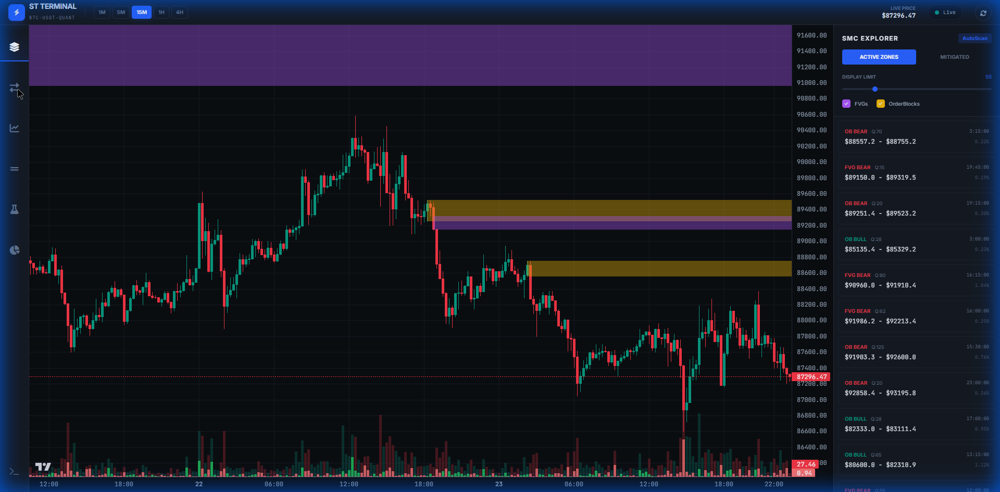

# BTC Quant Terminal (Svelte + Vite)

A high-performance, institutional-grade cryptocurrency analysis terminal rebuilt with **Svelte** and **Vite**. This application focuses on detecting liquidity traps, Smart Money Concepts (SMC), and providing a professional charting experience.



## 🚀 Features

- **Advanced Charting**: Powered by TradingView's Lightweight Charts, optimized for rendering thousands of candles and primitives.
- **Smart Money Concepts (SMC)**: 
  - Automated detection of Fair Value Gaps (FVG) and Order Blocks (OB).
  - Zone mitigation tracking and visualization.
  - Multi-timeframe analysis.
- **Liquidity Trap Strategies**:
  - **TL Trap (Standard/Agro)**: Reversal setups based on trendline liquidity sweeps.
  - **TL ATR**: Dynamic stop-loss management using Average True Range.
  - **Partial Exits**: Advanced trade management strategies with multiple Take Profit levels.
- **Historical Replay Mode**:
  - Full trade simulation with "Idea", "Entry", "TP", and "SL" markers.
  - Context-aware replay that preserves the exact market state (zones, lines) of the historical setup.
- **Performance Metrics**: Real-time calculation of Win Rate, Profit Factor, Sharpe Ratio, and Equity Curve.

## 🛠️ Installation

1. **Clone the repository**:
   ```bash
   git clone https://github.com/your-username/BTC-Chart-Terminal-ST.git
   cd BTC-Chart-Terminal-ST
   ```

2. **Install dependencies**:
   ```bash
   npm install
   ```

3. **Run the development server**:
   ```bash
   npm run dev
   ```

4. **Build for production**:
   ```bash
   npm run build
   ```

## 🖥️ Usage

- **SMC Explorer**: Toggle FVG/OB visibility, adjust detection sensitivity, and filter mitigated zones.
- **Trade Terminal**: Select your preferred strategy from the dropdown (SMC, TL Trap, etc.) to generate trade ideas.
- **Replay**: Click any trade in the "History" or "Ideas" tab to instantly replay the setup on the chart.

## 🤝 Contributing

Contributions are welcome! Please fork the repository and submit a pull request for any enhancements or bug fixes.

## 📄 License

This project is licensed under the MIT License.
