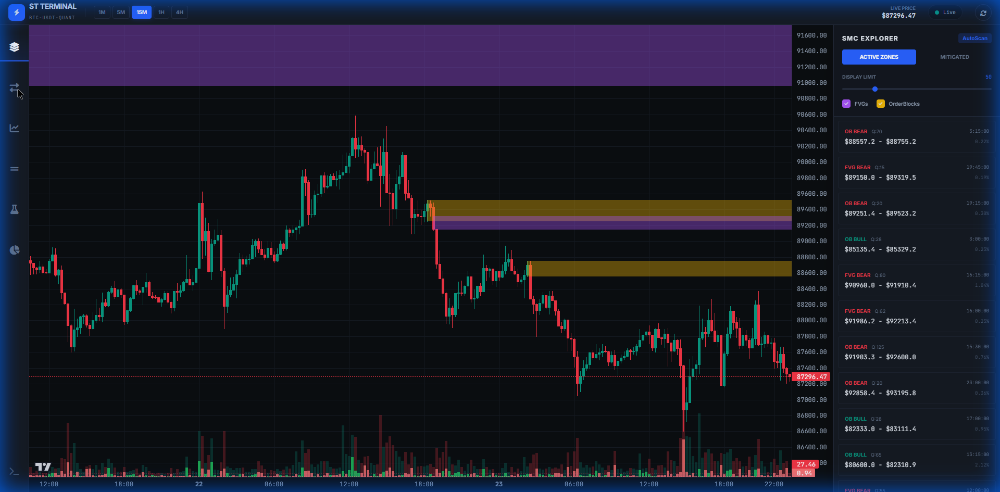

# BTC Quant Terminal (Svelte + Vite)

A high-performance, institutional-grade cryptocurrency analysis terminal rebuilt with **Svelte** and **Vite**. This application focuses on detecting liquidity traps, Smart Money Concepts (SMC), and providing a professional charting experience.



## 🚀 Features

- **Advanced Charting**: Powered by TradingView's Lightweight Charts, optimized for rendering thousands of candles and primitives.
- **Smart Money Concepts (SMC)**: 
  - Automated detection of Fair Value Gaps (FVG) and Order Blocks (OB).
  - Zone mitigation tracking and visualization.
  - Multi-timeframe analysis.
- **Liquidity Trap Strategies**:
  - **TL Trap (Standard/Agro)**: Reversal setups based on trendline liquidity sweeps.
  - **TL ATR**: Dynamic stop-loss management using Average True Range.
  - **Partial Exits**: Advanced trade management strategies with multiple Take Profit levels.
- **Historical Replay Mode**:
  - Full trade simulation with "Idea", "Entry", "TP", and "SL" markers.
  - Context-aware replay that preserves the exact market state (zones, lines) of the historical setup.
- **Backtest Engine (Rust/Wasm)**:
  - Strictly causal indicators - every value at bar `i` uses only bars `0..=i`. Enforced by
    a prefix-stability test suite (`cargo test`), not by convention.
  - Explicit intra-bar fill policy (SL-first by default) instead of an implicit optimistic one.
  - Single dollar ledger: risk-based position sizing, partial exits, stepped stops,
    liquidation guard, and a transaction-cost model (realistic taker/maker + funding,
    flat bps, or gross).
- **Quant Metrics**: CAGR, Sharpe / Sortino / Calmar annualized from the bar-level
  mark-to-market curve (365d), Ulcer index, VaR/CVaR, exposure, MAE/MFE, R distribution,
  monthly returns, bootstrap confidence intervals, Monte Carlo ruin probability,
  walk-forward split, and probabilistic / deflated Sharpe.
- **Cost sensitivity sweep**: re-runs the backtest across a range of per-side costs to show
  how much margin the edge actually has.

See [BACKTEST_BASELINE.md](./BACKTEST_BASELINE.md) for the before/after measurement of the
look-ahead and accounting fixes on real BTCUSDT data.

## 🛠️ Installation & Execution

### Option A: Isolated Docker Environment (Recommended)
Runs the entire stack (Rust Wasm compiler, DuckDB, Node.js API, and Vite UI) in an isolated container connected to `gli_postgres` without installing dependencies on your host:

```bash
# Start container with automatic post-build image prune
npm run docker:up
# Or with Make:
make docker-up
```
Open **http://localhost:5173** in your browser.

To stop or clean:
```bash
npm run docker:down    # Stop container
npm run docker:clean   # Reclaim build cache & dangling images
```

### Option B: Local Native Environment
1. **Copy environment variables**:
   ```bash
   cp .env.example .env
   ```
2. **Build WebAssembly engine & install dependencies**:
   ```bash
   npm run build:wasm
   npm install
   ```
3. **Start development server**:
   ```bash
   npm run dev
   ```

### Running the engine test suite
The causality and accounting guarantees are enforced by tests, so run them after any
change to `src-rust/`:
```bash
cd src-rust && cargo test
```

To reproduce the baseline table on your own candle file:
```bash
cd src-rust && cargo run --release --example baseline -- ../path/to/candles.json
```

## 🔌 Institutional Data Integrations (Local API)
The terminal includes a built-in API proxy providing access to:
- **PostgreSQL (`alt_scraper`)**: 240k+ 15m candles with order flow volume delta and Binance/Bybit/OKX futures metrics (Long/Short ratio, Open Interest, Liquidations).
- **PostgreSQL (`gli_dashboard`)**: Hyperliquid order book L2 depth, perp context, and Deribit options Greeks (GEX / DEX).
- **Parquet Storage (`DuckDB`)**: Direct, sub-millisecond query access to 1-minute historical datasets from `GLI-CLI-Estimation`.

## 🤝 Contributing

Contributions are welcome! Please fork the repository and submit a pull request for any enhancements or bug fixes.

## 📄 License

This project is licensed under the MIT License.
